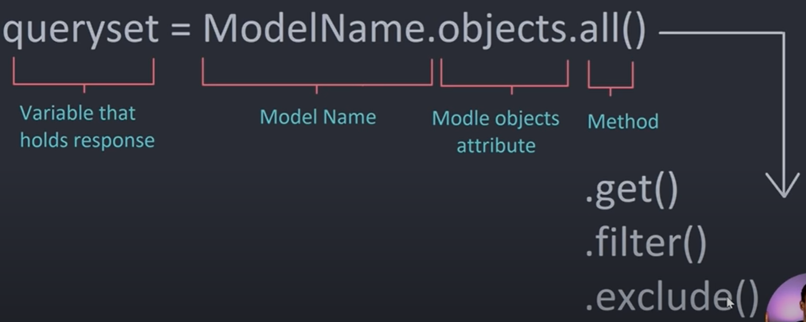

## Getting Started

```
sudo pip install virtualenv
virtualenv env
sudo chmod +x env/bin/activate
source /env/bin/activate
pip install django
```
`django-admin` shows list of all django commands

---
To start an application use
```django-admin startproject studybud```
This initializes a folder called stydybud with necessary files and folders inside
```
django-admin startproject studybud
cd studybud
python manage.py runserver
```
- sqlite is the default database with django
- wsgi - web server gateway interface
-  urls.py - all the url routings to our project
    -  urlpatterns = [
            path('admin/', admin.site.urls),
        ]
        will be a list of all the url patterns
        // urls trigger views
- settings.py - core configuration of out project
---
### Creating a new app
```
python manage.py startapp base
```
- models.py - where we configure the database
- views.py - 

- add line `'base.apps.BaseConfig'` to the `INSTALLED_APPS` list in `studybud/settings.py` 
```    
    INSTALLED_APPS = [
        'django.contrib.admin',
        'django.contrib.auth',
        'django.contrib.contenttypes',
        'django.contrib.sessions',
        'django.contrib.messages',
        'django.contrib.staticfiles',

        'base.apps.BaseConfig',
    ]
```
- in ***`studybud/urls.py`***
    added function called `home()` and `room()`
- cut and paste `home()` and `room()` to ***`base/views.py`***
- create `base/urls.py` just to handle all the routes from the base app
- add `path('', include('base.urls'))` to urlpatterns in ***`studybud/urls.py/urlpatterns`***

- create a folder ***`templates`*** and files `home.html` and `room.html` inside it
- add  `BASE_DIR / 'templates'` to *`studybud/settings.py/TEMPLATES/Dirs`* list
    to make the app know about the templates directory
```
TEMPLATES = [
    {
        'BACKEND': 'django.template.backends.django.DjangoTemplates',
        'DIRS': [
            BASE_DIR / 'templates'
        ],
        'APP_DIRS': True,
        'OPTIONS': {
            'context_processors': [
                'django.template.context_processors.debug',
                'django.template.context_processors.request',
                'django.contrib.auth.context_processors.auth',
                'django.contrib.messages.context_processors.messages',
            ],
        },
    },
]
```
- modify `base/views.py/home()` by adding the render method
```
return render (request, 'home.html')
```

## Template inheritance
we can also inherit templates inside other templates
- create *`templates/navbar.html`*
- make the *`navbar.html`* file
- `` - place this where you want to import navbar
- create *`main.html`* and extend it to *`room.html`* and *`home.html`*

### Learn about django templating engine

- added `rooms []` list to *`base/views.py`* (*now commented*)
- create a `div` in *`home.html`* to render the `rooms[]` list

- create *`base/templates`* and then *`base/templates/base`* and *`base/templates/base/home.html`*
- copy *`templates/home.html`* to *`base/templates/base/home.html`*
- delete *`templates/home.html`* 
- make modifications in `home()` in *`base/views.py/home()/render`*

### Dynamic Url Routing - How to see a specific object on clicking specific links( link the rooms[])
- added `path('room/<str:pk>/', views.room, name="room"),` to *`base/urls.py/urlpatterns`*
- added argument `pk` to *`base/views.py/room()`*
- added `<a href="room/{{room.id}}">` in *`base/template/base/home.html`*
- change the *`base/views.py/room()`* function  and *`base/template/base/room.html`* accordingly

### Database Things
- `python3 manage.py migrate` (it will apply all migrations and build the database)

- go to *`base/models.py`*
- create `class Room()` in *base/models.py*
- add `from .models import Room` to *base/admin.py*
- add `admin.site.register(Room)` to *base/admin.py*
- similar for message model ...

- changes in base/views.py
    - `from .models import Room`
    - *home()* - `rooms = Room.objects.all()`
    - *room()* - `room = Room.objects.get(id=pk)`

        

- add the entries of message and topic from django admin

> When we add a model to our database, the first thing we need to do is to `makemigrations`. 
This will basically create a file that contains a list of sql commands and how to execute this and add it to the database. So, we already migrated our database, we executed built-in migrations and now we are making new migrations. <br/>
> - ```python manage.py makemigrations```
<br/>We are gonna see a new file, a new migration is generated each time. Right now it is `0001_initial.py`. Once you make a migration you have to do it everytime <br/>
> - ```python manage.py migrate``` <br/>
*migrate* will go into the latest migrations and execute those. We will then see these migrations getting applied. It will apply base.0001_initial... <br/>

> Now you have a database so you can go to admin panel `url/admin/` to see the database. You will need an admin level permission to use this. We are going to create this from the *`command prompt`*. 
> - ```python manage.py createsuperuser```

### Adding room_form
- create *`base/template/base/room_form.html`*
- create *`view base/views.py`*
- add to *`base/urls.py/urlpatterns`*
- changing the templates accordingly

### Making it functional*** 
- create *`forms.py`*
- import *`forms.RoomForm`* in *views.py*
- make changes in *room_form.html*

### Update Room
- create a view in *`base/views.py/updateRoom()`*


### Search 

- import Topic in base/views.py

### Authentication

> How django deals with it? 
django by default has session based authentication...

- create template/base/login_registration.html


### Registration

### Creating Conversations

### Adding Participants
- change models.py/Room
- what is related name
- what is blank=True

### Using static files
- make a folder static at the root directory
- add it to *`settings.py`*
```
    STATICFILES_DIRS = [
        BASE_DIR / 'static'
    ]
```
- add line `` to main.html
- give the link to *`main.css`* in `href`

## modifying the create_room form
- modify *forms.py*


### Django rest framework
- create *`base/api folder`*
- create *`base/api/__init__.py`*
- create *`serializers.py`*
- create *`urls.py`*
- create *`views.py`*
- add `path('api/', include('base.api.urls'))` line to *`studybud/urls.py/urlpatterns`*

### Install django REST framework
```
pip install djangorestframework
```
- add `'rest_framework'` to *`settings.py/INSTALLED_APPS`*
> ### read django REST framework documentation


### Installing django-cors-headers
```
python -m pip install django-cors-headers
```
- add `'corsheaders'` to *`settings.py/INSTALLED_APPS`*
- add `'corsheaders.middleware.CorsMiddleware'`,
    `'django.middleware.common.CommonMiddleware'`,
    to *`settings.py/MIDDLEWARE[]`*
```
INSTALLED_APPS = [
    'django.contrib.admin',
    'django.contrib.auth',
    'django.contrib.contenttypes',
    'django.contrib.sessions',
    'django.contrib.messages',
    'django.contrib.staticfiles',

    'base.apps.BaseConfig',

    'rest_framework',
    'corsheaders'
]

MIDDLEWARE = [
    'django.middleware.security.SecurityMiddleware',
    'django.contrib.sessions.middleware.SessionMiddleware',
    'django.middleware.common.CommonMiddleware',
    'django.middleware.csrf.CsrfViewMiddleware',
    'django.contrib.auth.middleware.AuthenticationMiddleware',
    'django.contrib.messages.middleware.MessageMiddleware',
    'django.middleware.clickjacking.XFrameOptionsMiddleware',

    'corsheaders.middleware.CorsMiddleware',
    'django.middleware.common.CommonMiddleware',
]
```
- add line
    `CORS_ALLOW_ALL_ORIGINS=True`
    to *`settings.py`* <br/>
    or you can use this allow list
```    
    CORS_ALLOWED_ORIGINS = [
        "https://example.com",
        "https://sub.example.com",
        "http://localhost:8080",
        "http://127.0.0.1:9000",
    ]
```

## EXTRA
- To generate ***requirements.txt*** use 
`pip freeze > requirements.txt`
- To install ***requirements.txt*** use 
`pip install -r requirements.txt`
